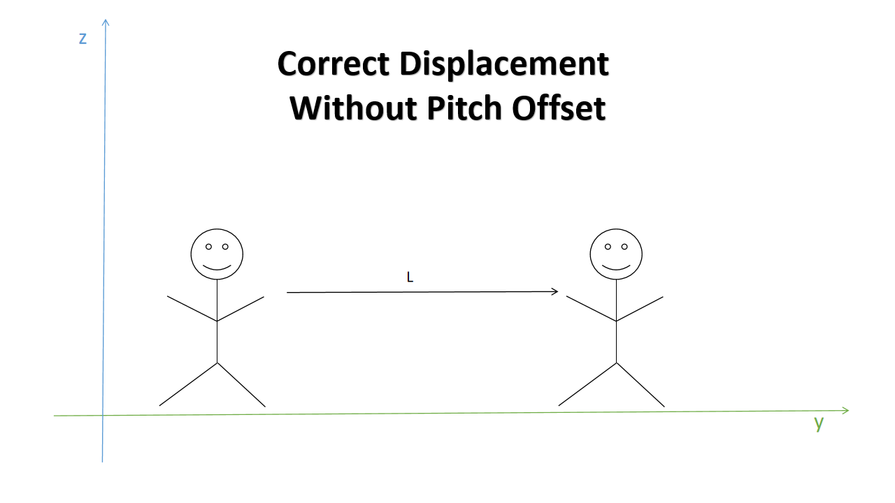
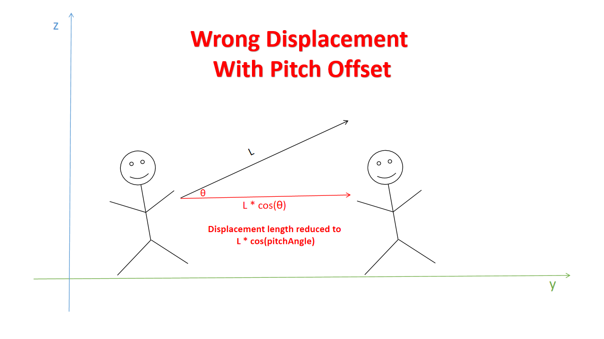

# Introduction Of Animation Motion Fix 

## Synopsis
**Animation Motion Fix** (refer as AMF) is a SKSE plugin that intend to fix issues of Skyrim game engine 's animation root motion system. In vanilla Skyrim, actors would encounter motion reduction or motion stuck issue when they performing root motion animation during combat, while those issues just getting much more apparent and unbearable in modern combat animations mods environment. With AMF installed, actors motion would no longer get reduced or stuck when they performing root motion animation.

## Mod Features

### Fix - Fix NPC pitch angle translation 
The vanilla game engine has used a wrong method to compute NPCs animation motion when NPCs were on ground(not flying), it has taken consideration of the NPCs pitch angle offset and transferred the displacement amount from Y axis to Z axis, thus NPCs Y axis displacement would got reduced in some degree that proportional with their pitch angle offset.



This issue usually occurs when NPCS are in combat since NPCS always adjusts their pitch angle during combat.
One of the most common case in vanilla is NPCs stagger animations would be markedly reduced after entered combat state.  
To enable this fix, you need to have setting `EnablePitchTranslationFix` value be true in "AnimationMotionFix.ini".
 ```ini
 [Fix]
 EnablePitchTranslationFix = true

 ```  
<br>

 ### Tweak - Disable attack magnetism effect
The vanilla game engine has applied some kind of attack magnetism affect on an attack animation motion driven actor which would caused the actors animation root motion quantity be cleared to zero when it collided with it combat target. As a result, the actors attack animations would lost displacement and get stuck in place after collided with another actor in combat. It might be all right for the vanilla attack animations, but doesn't work well when combining with those modern action game style mod.
To disable actors attack magnetism effect and prevent motion stuck situation, you need to have these settings value be true in "AnimationMotionFix.ini".
```ini
[Tweak]
DisablePlayerRotationMagnetism = true

DisablePlayerMovementMagnetism = true

DisableNpcMovementMagnetism = true
```